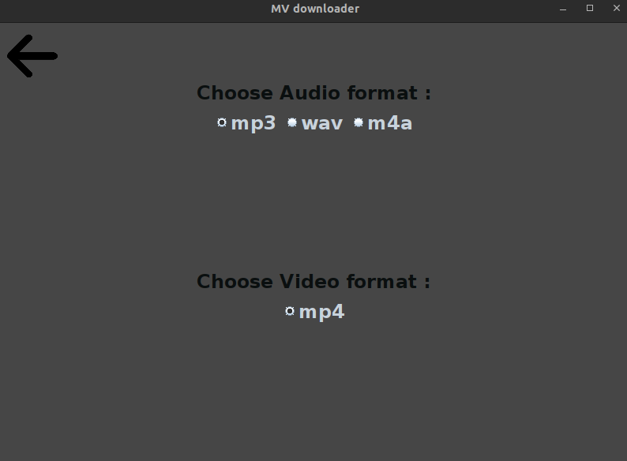
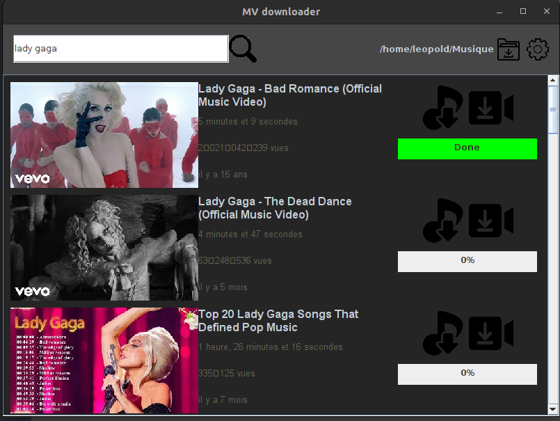
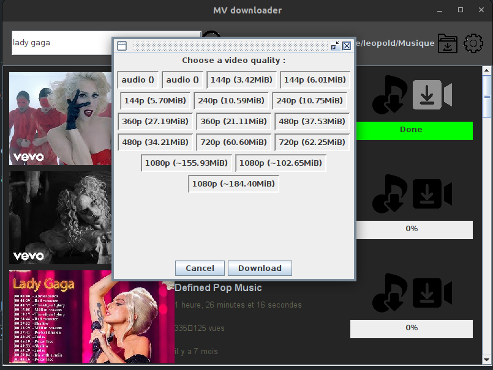

# mv-dl

# Présentation :

Ce projet à pour but de telecharger des videos et des musiques facilement. Il utilise notamment le projet yt-dlp pour pouvoir les telecharger. La conversion des musiques et des vidéos dans de bons formats s'effectue ensuite grâce au logiciel ffmpeg (mp3, wav..)

yt-dlp : https://github.com/yt-dlp/yt-dlp
ffmpeg : https://github.com/FFmpeg/FFmpeg

# Utilisation :

## Dossier de Téléchargement :

L'icône situé en haut à droite, en forme de dossier vous permet de selectionner le dossier pour le téléchargement de vos musics/vidéos. Il suffit de cliquer dessus et une fenetre de selection va s'ouvrir.

## Paramètres :

Vous pouvez ouvrir les paramètres en cliquant sur l'icône en haut
à droite en forme d'engrenage.

Dans les paramètres, vous pouvez changer :
Le format audio pour le téléchargement de musics:
- mp3, wav, m4a, webm

Le format des vidéos :
- mp4 (uniquement celui là pour le moment) 

## Télécharger des musics

Après avoir effectué une recherche, vous pouvez voir differentes videos s'afficher. Pour télécharger l'audio d'une de ces vidéos il vous suffit de cliquer l'icone en forme de note de music situé a droite de la video.

## Télécharger des vidéos

Pour la vidéo, vous pouvez cliquer sur l'icone en forme de caméra situé à droite. Une page avec les différentes qualités va s'ouvrir. Il vous suffit d'en selectionner une puis de valider votre choix. La qualité de l'audio de la vidéo est automatiquement la meilleure possible.

# Lancement

Ajouter les droits d'execution sur mv-dl :

> chmod u+x ./mv-dl

Puis executer le binaire :

> ./mv-dl

Si ça ne fonctionne pas, vous pouvez lancer directement le jar vous même :

> java -cp mv-dl.jar com.mvdl.launcher.Launcher 

Bon téléchargement ;)

L. A.

# Preview

